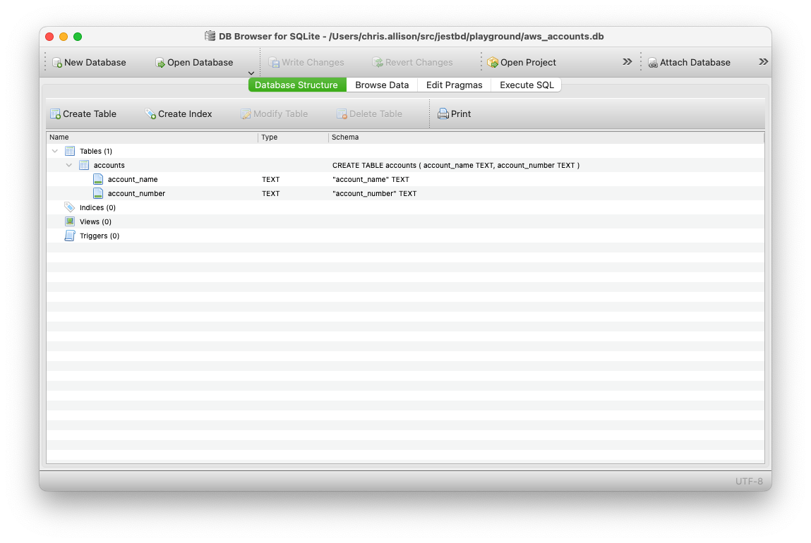
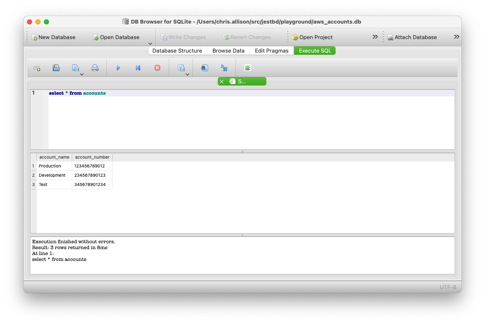

## Contents

1. [Index / README](../README.md)
1. [The findaccount Problem](docs/thefindaccountprob.md)
1. Data Organisation
1. [Relationships](relationships.md)
1. [Data Validation](validation.md)
1. [Accessing Data with Python](python1.md)
1. [ORM with SQLAlchemy](orm.md)
1. [Using the ORM](usingtheorm.md)

# Data Organisation

There are many ways to organise blobs of data. The two most common are Key/Value
stores and Relational Databases. Key/Value stores are simple and fast, and are
useful if there is no meaningful relationship between the Keys. Relational
Databases allow you to make those relationships and retrieve data using them.

## Structured Query Language (SQL)

SQL is a language used to interact with relational databases. It is used to
create, read, update and delete data and the relationships between data. It is
also used to create the definition of the data, the tables, columns and indexes.

## Database Servers

There are many different database servers available. Some of the most popular
are:

* [mariadb](https://mariadb.org/)
* [mysql](https://www.mysql.com/)
* [postgresql](https://www.postgresql.org/)
* [mssql](https://www.microsoft.com/en-gb/sql-server)
* [oracle](https://www.oracle.com/database/)
* [db2](https://www.ibm.com/uk-en/analytics/db2)
* [sybase](https://www.sap.com/products/sybase.html)
* [SAP HANA](https://www.sap.com/products/hana.html)
* [sqlite](https://www.sqlite.org/index.html)

We will be using SQLite for this course as it is open-source, simple to install and use.

## Databases

Databases typically hold data in tables. Each table is a collection of rows with
the Columns defining the data in each row. The structure can be visualised thus:

```
Database1
    D1-Table1
        Column1  | Column2  | ColumnN
        Row1-c1  | Row1-c2  | Row1-cN
        Row2-c1  | Row2-c2  | Row2-cN
        RowN-c1  | RowN-c2  | RowN-cN
    D1-TableN
        Column1  | Column2  | ColumnN
        Row1-c1  | Row1-c2  | Row1-cN
        Row2-c1  | Row2-c2  | Row2-cN
        RowN-c1  | RowN-c2  | RowN-cN

DatabaseN
    DN-Table1
        Column1  | Column2  | ColumnN
        Row1-c1  | Row1-c2  | Row1-cN
        Row2-c1  | Row2-c2  | Row2-cN
        RowN-c1  | RowN-c2  | RowN-cN
    DN-TableN
        Column1  | Column2  | ColumnN
        Row1-c1  | Row1-c2  | Row1-cN
        Row2-c1  | Row2-c2  | Row2-cN
        RowN-c1  | RowN-c2  | RowN-cN
```

SQLite is a file-based database, which means that the database is stored in a
file so therefore it can only operate on one Database at once. Other database
Servers are network-based and can operate on many databases at once. As that
introduces unnecessary complexity, we will stick with SQLite.

## AWS Account Information Database

We will start simply with one table that holds information about AWS Accounts.
We will need 2 columns:

* Account Name (string)
* Account Number (string)

Note: the account number is also stored as a string as it often starts with a
zero and we don't want to lose that zero. It'll never be used in a calculation
or as a number so it's safe to store it as a string.

## Creating the Database

We will create a new database file called `aws_accounts.db` and create a table
called `accounts` with the two columns we need.

```sql
DROP TABLE if exists accounts;
CREATE TABLE accounts (
    account_number TEXT PRIMARY KEY,
    account_name TEXT
) WITHOUT ROWID;
```

Save that statement into a file called `createtable.sql`.

The words in CAPITALS are SQL keywords and the words in lowercase are the names

* DROP TABLE - deletes the table (if it exists)
* CREATE TABLE - creates a new table called `accounts`
* account_number - the name of the column
    * TEXT - the data type of the column
    * PRIMARY KEY - this column is the primary key (more on this later)
* account_name - the name of the column
    * TEXT - the data type of the column
* WITHOUT ROWID - As AWS Account IDs are unique we will be using that as an
    index (or the `primary key`) and will not need the automatic rowid that SQLite creates for each row.
    see [Without RowId](https://www.sqlite.org/withoutrowid.html)

The PRIMARY KEY is a unique identifier for each row in the table. It is used to
ensure that each row is unique and can be used to retrieve a specific row. In
SQLite, the PRIMARY KEY is also an index, which means that it is used to speed
up searches. It can automatically be generated by SQLite if you don't specify it
in the column descriptions.

Now we can create the table in the database. This statement will create a new
file called `aws_accounts.db` and create the table `accounts` in it.

```bash
sqlite3 aws_accounts.db < createtable.sql
```

## Inserting Data

Now we have a database and a table, we can insert some data. We will insert 3
made up accounts:

* Account Name: `Production`, Account Number: `123456789012`
* Account Name: `Development`, Account Number: `234567890123`
* Account Name: `Test`, Account Number: `345678901234`

```sql
INSERT INTO accounts (account_name, account_number) VALUES ('Production', '123456789012');
INSERT INTO accounts (account_name, account_number) VALUES ('Development','234567890123');
INSERT INTO accounts (account_name, account_number) VALUES ('Test','345678901234');
```

save that into a file called `insertdata.sql` and run it:

```bash
sqlite3 aws_accounts.db < insertdata.sql
```

## Retrieving Data

Sqlite comes with a command line tool that allows you to run SQL statements.
However, for now we will use the DB Browser for SQLite to run our statements and
investigate the data we have inserted.

Open the `aws_accounts.db` file in the DB Browser. You should see something
similiar to:



Click on the `Execute SQL` tab and enter the following SQL statement:

```sql
SELECT * FROM accounts;
```



## Contents

1. [Index / README](../README.md)
1. [The findaccount Problem](docs/thefindaccountprob.md)
1. Data Organisation
1. [Relationships](relationships.md)
1. [Data Validation](validation.md)
1. [Accessing Data with Python](python1.md)
1. [ORM with SQLAlchemy](orm.md)
1. [Using the ORM](usingtheorm.md)
